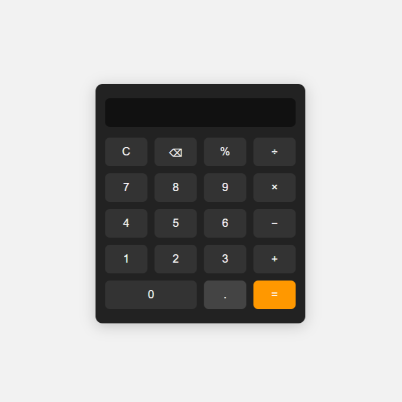

It is simple, responsive calculator web application built using **HTML**, **CSS**, and **JavaScript**. It performs basic arithmetic operations: addition, subtraction, multiplication, and division.

# Features

- Basic arithmetic operations
- Responsive UI design
- Clear and Delete functionality
- Easy to customize and extend

# Screenshot

 

# Tech Stack

- HTML5 – Structure of the calculator
- CSS3 – Styling and layout
- JavaScript (ES6) – Logic and functionality

# Project Structure
 
├── index.html # Main HTML file

├── style.css # Styling

├── script.js # JavaScript logic

└── README.md # Project documentation

 # How It Works

1. User clicks number and operator buttons.
2. JavaScript captures inputs and performs calculations.
3. Result is displayed on the screen in real time or after pressing `=`.

# Setup Instructions

1. Clone the repository or download the ZIP.
    ```
    https://github.com/ranukumar11/CodeAlpha_Calculator
    ```
2. Navigate to the project folder:
    ```
    CodeAlpha_Calculator
    ```
3. Open `index.html` in your browser.

 # Example Usage

 Input: 12 + 5 × 3
 Output: 27
   
# Future Improvements

- Add keyboard support
- Add history/log feature
- Add dark/light theme toggle

# Author

- Name: Ranu Kumar
- GitHub: [@ranukumar11](https://github.com/ranukumar11)


